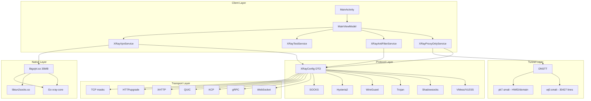

# Happ Android 4.0.1 — Fully Decompiled Source Code

> **Complete reverse-engineered source of the Happ proxy client (v4.0.1)** — all Java, Smali, and Go JNI interfaces. For educational and research purposes.

[](https://github.com/ded648238/happ-android-full-decompiled/stargazers)
[](https://github.com/ded648238/happ-android-full-decompiled/network/members)
[](https://github.com/ded648238/happ-android-full-decompiled/watchers)
[](LICENSE)
[](https://github.com/ded648238/happ-android-full-decompiled/releases)
[](https://github.com/ded648238/happ-android-full-decompiled/pulse)
[](https://github.com/ded648238/happ-android-full-decompiled/archive/refs/heads/main.zip)
[](https://github.com/ded648238/happ-android-full-decompiled/commits/main)
[](https://developer.android.com)
[](https://www.java.com)
[](smali)
[](https://github.com/ded648238/happ-android-full-decompiled/stargazers)

## 📦 Overview

This repository contains the **complete decompiled source code** of [Happ Proxy](https://github.com/Happ-proxy/happ-android) (v4.0.1, versionCode 1581), an Android VPN/proxy client built on xray-core.

### What's included

| Category | Count | Details |
|---|---|---|
| **Java sources** | 2,252 `.java` | Decompiled with jadx 1.5.6 from all 3 dex files |
| **Smali bytecode** | 11,583 `.smali` | Full disassembly, 0 empty files |
| **Go JNI bridge** | 41,962 symbols | Extracted from `libgojni.so` (stock xray-core + gomobile) |
| **Resources** | 986 lines | 80+ localized strings, themes, drawables |
| **Config examples** | 2 files | Default Xray configs (with TUN) |

### 🏗 Architecture



## 🔑 Key Classes & Discoveries

### Java (fully readable)

- **`XRayConfig.java`** — 4,544 lines. Complete model of every Xray protocol and transport
- **`EncryptedSubUrlHelper.java`** — 167KB. Subscription URL encryption logic
- **`RequestEnvelope.java`** — DNSTT protocol v1 (DeviceOS enum, Route enum, full struct)
- **`MainViewModel.java`** — 61KB. Main UI logic and state management
- **`XRayProxyOnlyService.java`** — Proxy mode implementation
- **`XRayAntiFilterService.java`** — Anti-censorship bypass
- **`XRayTestService.java`** — Connection ping and test utilities
- **`XRayVpnService.java`** — 1,311 lines. TUN setup, DNS, per-app proxy, SOCKS/HTTP auth

### Smali (jadx couldn't decompile to Java)

- **`wj0.smali`** — DNSTT dispatcher, 30,427 lines
- **`pk7.smali`** — HWID, hashedDomain (SHA-256), hex encoding helpers

### Go Core (libgojni.so)

- Stock **xtls/xray-core** + gomobile bind wrapper
- 41,962 Go functions extracted from `.gopclntab`
- Modules: quic-go (Hysteria2), circl (ML-KEM), brotli, gvisor TUN

## 🔍 Secrets Discovered

| Secret | Value | Location |
|---|---|---|
| **HWID** | `Settings.Secure.ANDROID_ID` | `pk7.k` |
| **hashedDomain** | SHA-256(host) hex | `pk7.s` |
| **DNSTT servers** | `t.polend.org`, `t.pullse.org`, `t.itine.org` | `pk7.smali` |

## 📂 Repository Structure

```
happ-android-full-decompiled/
├── smali/                 # 11,583 .smali files (100% complete)
│   ├── su/happ/           # Main app code
│   │   ├── proxyutility/  # All services, features, UI
│   │   └── ...
│   ├── pk7.smali          # HWID/domain helpers (9,003 lines)
│   └── wj0.smali          # DNSTT dispatcher (30,427 lines)
├── su/                    # 2,252 .java files (100% complete)
│   ├── happ/proxyutility/ # All decompiled Java
│   └── ...
├── com/                   # Third-party libraries (AndroidX, etc.)
├── io/                    # Sentry, OkHttp, Conscrypt
├── libxray/               # JNI bridge (Libxray, XRayPoint, ConsoleLogWriter)
├── go/                    # Go JNI bridge (Seq, Universe)
├── res/                   # All Android resources
├── AndroidManifest.xml    # Full manifest (40+ activities, services)
├── go_funcs.txt           # 41,962 Go function symbols
└── docs/                  # Analysis documents
```

## 🛠 Build / Test

This is a decompiled source for **research and educational purposes** only.

To verify decompilation quality:

```bash
# Check all smali files are non-empty
find smali -name "*.smali" -size 0 | wc -l  # Should be 0

# Count total files
find . -name "*.smali" -o -name "*.java" | wc -l  # Should be 13,835

# Check specific class
cat smali/su/happ/proxyutility/util/dnsttv/dto/RequestEnvelope.smali | wc -l
```

## 📚 Documentation

- [`docs/go-core-re.md`](docs/go-core-re.md) — Go core reverse engineering report
- [`docs/dnstt-protocol.md`](docs/dnstt-protocol.md) — DNSTT protocol analysis

## ⚠️ Disclaimer

This repository is for **educational and research purposes only**. It contains decompiled code from a third-party application. Please respect the original application's license and terms of service. This project does not endorse or encourage any illegal activities.

The original application can be found at: https://github.com/Happ-proxy/happ-android

## 🤝 Contributing

Contributions are welcome! Please:

- Report errors in decompiled code
- Help translate comments
- Add documentation or diagrams
- Improve the structure or navigation

See [CONTRIBUTING.md](CONTRIBUTING.md) for details.

## 📄 License

This project is licensed under the **MIT License** — see [LICENSE](LICENSE).

> Note: This is a decompiled version. The original Happ Android application may have its own license.

## 📊 Stats

| Metric | Value |
|---|---|
| Total files | 13,835 |
| Java files | 2,252 |
| Smali files | 11,583 |
| Go functions | 41,962 |
| Largest file | `wj0.smali` (30,427 lines) |
| Repo size | 222 MB |
| Decompiler | jadx 1.5.6 + baksmali |

---

**Made with jadx, baksmali, and ❤️ for open-source research.**
